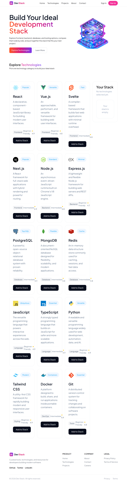

# 🧩 Dev Stack Builder

A modern and responsive development stack builder website built with **React, TypeScript, and Tailwind CSS**. The project allows developers to explore popular technologies, view their categories, difficulty levels, ratings, and descriptions, and build a personalized development stack by selecting the technologies they want to use.

This project was created as part of my web development course to practice React component architecture, TypeScript, props, state management, API data fetching, conditional rendering, responsive design, and third-party NPM packages.

---

## 🌐 Live Demo

🔗 **[View Live Website](https://dev-stack-builder-website-phi.vercel.app/)**

---

## 📸 Project Preview

<p align="center">
  
</p>

---

## 💻 GitHub Repository

🔗 **[View Source Code](https://github.com/imamrakib354/Dev-stack-builder-website)**

---

## 🛠️ Technologies Used

- **React.js** — Building the user interface with reusable components
- **TypeScript** — Type-safe development and defining technology data structures
- **JavaScript (ES6+)** — Application logic and modern JavaScript features
- **Tailwind CSS** — Utility-first styling, layouts, spacing, and responsive design
- **DaisyUI** — Additional UI components and utilities
- **React-Toastify** — Toast notifications for stack actions
- **JSON** — Technology data source
- **My JSON Server** — Public API endpoint for technology data
- **Vite** — Development server and build tool

---

## ✨ Main Features

- 🧩 Explore popular development technologies
- 📊 View technology descriptions, categories, difficulty levels, ratings, icons, and badges
- ➕ Add technologies to a personalized development stack
- 🚫 Prevent already-added technologies from being added again
- ❌ Remove individual technologies from the stack
- 🗑️ Remove all selected technologies at once
- 🔔 Show toast notifications when technologies are added or removed
- ⏳ Show a loading state while technology data is being fetched
- 📱 Responsive layout for mobile, tablet, and desktop screens
- 🎨 Modern card-based interface with gradient colors

---

## 🧠 How It Works

Technology information is fetched from a JSON API and rendered dynamically using React.

Each technology is displayed through a reusable `Technology` component. When a user adds a technology, the parent `Technologies` component stores it in React state and passes the selected technologies to the `Stack` component.

The stack can be managed by removing individual technologies or clearing all selected technologies.

React `Suspense` and the `use()` hook are used to handle the technology data Promise and display a loading state while the data is being fetched.

---

## 📂 Project Structure

```text
Dev-stack-builder-website/
│
├── public/
│
├── src/
│   ├── assets/
│   │   ├── banner-stack.png
│   │   ├── hamburger.png
│   │   └── logo-text.png
│   │
│   ├── components/
│   │   ├── Banner.tsx
│   │   ├── Footer.tsx
│   │   ├── Nav.tsx
│   │   ├── Stack.tsx
│   │   ├── Technologies.tsx
│   │   └── Technology.tsx
│   │
│   ├── App.tsx
│   ├── Technology.ts
│   ├── index.css
│   └── main.tsx
│
├── index.html
├── package.json
├── tsconfig.json
├── vite.config.ts
└── README.md
```

---

## 📦 Dependencies & External Resources

### React

Used to build the application using reusable functional components.

### TypeScript

Used to add static typing and define the structure of technology data and component props.

### Tailwind CSS

Used for styling, spacing, typography, layouts, and responsive design.

### DaisyUI

Used for additional UI utilities and components.

### React-Toastify

Used to display toast notifications for stack actions such as adding and removing technologies.

### My JSON Server

Technology information is loaded from a public JSON API.

**API Endpoint:**

https://my-json-server.typicode.com/imamrakib354/dev-stack-data/technologies

### Google Fonts

The project uses **Plus Jakarta Sans** and **Inter** for typography.

---

## 🚀 How to Run Locally

### 1. Clone the repository

```bash
git clone https://github.com/imamrakib354/Dev-stack-builder-website.git
```

### 2. Open the project folder

```bash
cd Dev-stack-builder-website
```

### 3. Install dependencies

```bash
npm install
```

### 4. Start the development server

```bash
npm run dev
```

Open the local URL provided by Vite in your browser.

---

## 📜 Available Scripts

### Development

```bash
npm run dev
```

Starts the Vite development server.

### Production Build

```bash
npm run build
```

Creates an optimized production build.

### Preview Production Build

```bash
npm run preview
```

Runs the production build locally for preview.

---

## ⚛️ Short answers of react questions

### 1. What is JSX, and why is it used in React?

JSX is basically a syntax extension for JavaScript .It is a syntax that allows us to write HTML-like markup inside JavaScript or TypeScript. It makes it easier to describe the UI in React.

### 2. What is the difference between props and state?

Props are data passed from a parent component to a child component, and they are received as a props object. State is data managed inside a component that can change over time. When state changes, React re-renders the component and updates the UI. 

### 3. What does the `useState` hook do, and where did you use it in this project?

`useState` allows a functional component to store and manage data that can change over time. I used it in `Technologies.tsx` to store the technologies selected by the user. When a user selects a technology, it is added to the stack, and when the user removes it, it is removed from the stack and the UI is updated.

### 4. What does the `useEffect` hook do, and why did you need it to load the JSON data?

`useEffect` is used to handle side effects in a React component, such as fetching or loading data.  I did not use `useEffect` for loading the JSON data in this project. Instead, I used a Promise with React `Suspense` and the `use()` hook.

### 5. Why does every item in a `.map()` list need a unique `key` prop?

The `key` prop helps React uniquely identify each item in a list. It allows React to efficiently track which items are added, removed, or changed and update only the necessary parts of the UI. 

### 6. What is conditional rendering?

Conditional rendering means displaying different UI depending on a condition. I used it in `Stack.tsx` to show an empty-stack message when no technologies are selected.

```tsx
{selectedTechnologies.length === 0 ? (
    <p>Your stack is empty.</p>
) : (
    <div>...</div>
)}
```

### 7. How do you pass data from a parent component to a child component, and how does a child send something back to the parent?

A parent passes data to a child through props. To send information back, the parent passes a function as a prop, and the child calls that function with the required data. In my project, `Technologies.tsx` passes technology data and handler functions to the `Technology` and `Stack` components.

---

## 🔗 Relevant Links

- 🌐 **Live Website:** [Dev Stack Builder](https://dev-stack-builder-website-phi.vercel.app/)
- 💻 **GitHub Repository:** [Dev Stack Builder](https://github.com/imamrakib354/Dev-stack-builder-website)

---

## 📚 Course Project

This project was developed as part of my web development course to practice building a complete React application using reusable components, TypeScript, API data, state management, responsive layouts, and external NPM packages.

---

## 👨‍💻 Author

**Imam Hossain Rakib**

- GitHub: [@imamrakib354](https://github.com/imamrakib354)
- LinkedIn: [Imam Hossain Rakib](https://www.linkedin.com/in/Imam-hossain-b22015381/)
- Email: rakibimam50@gmail.com
